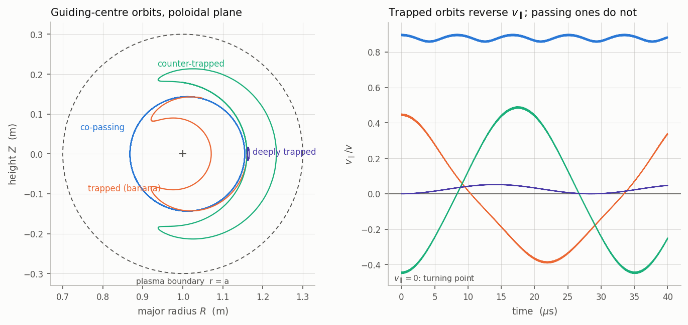
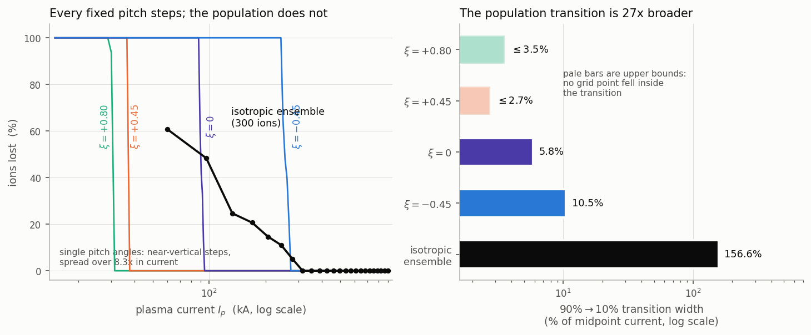
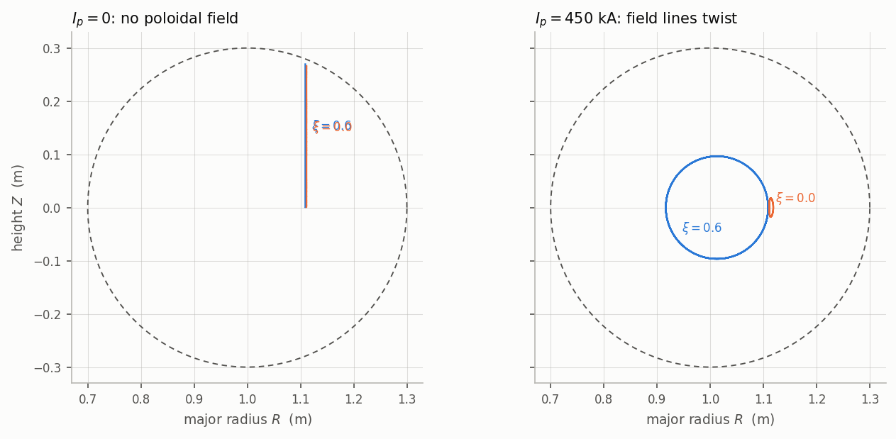
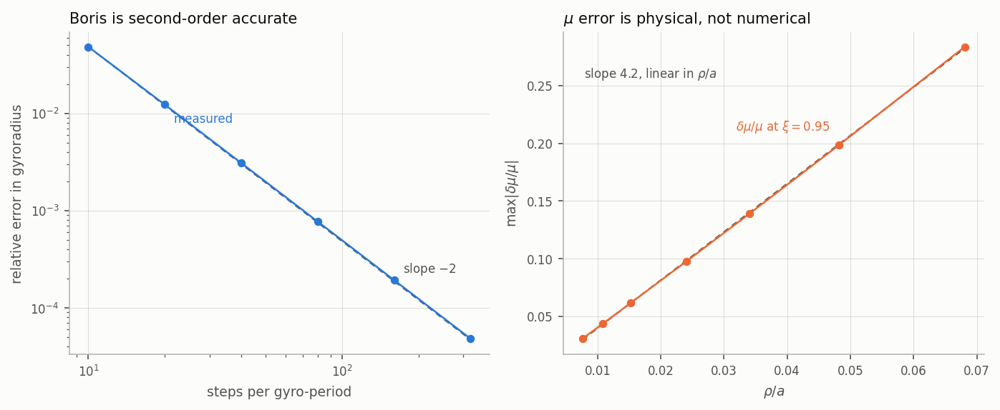
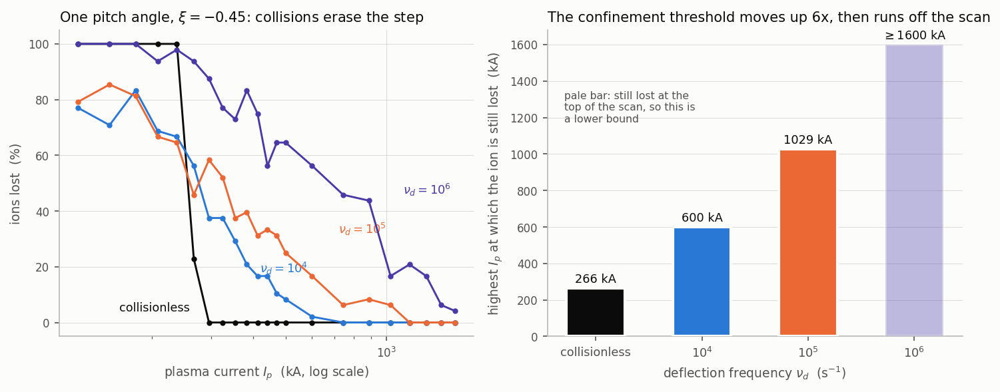
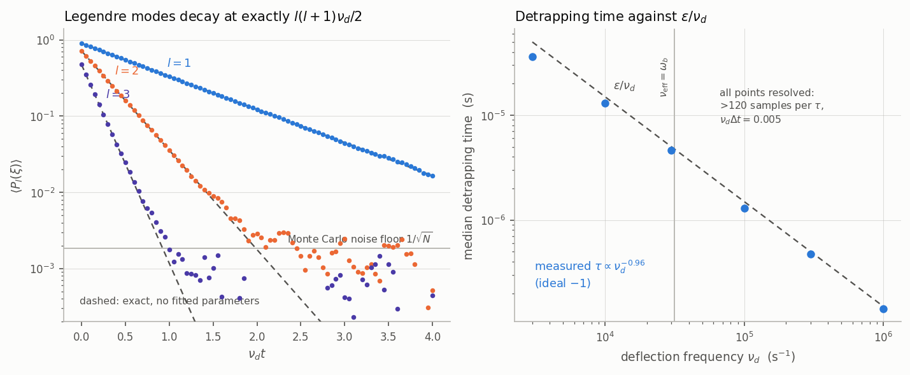
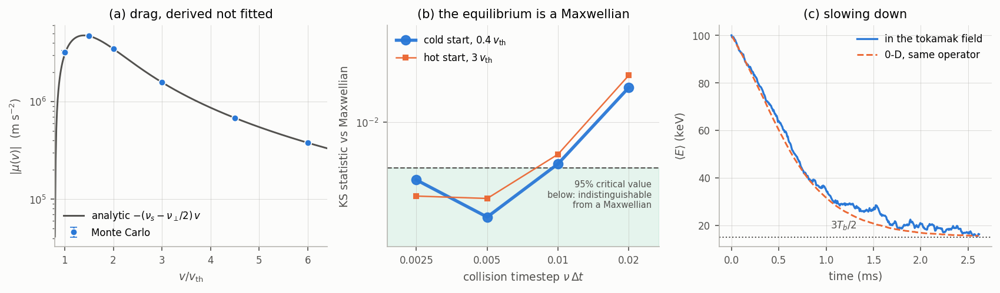
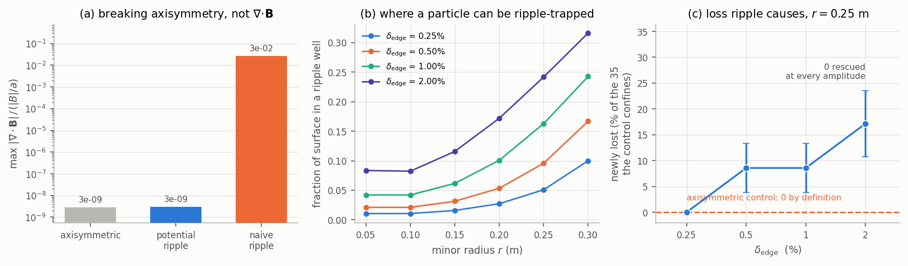
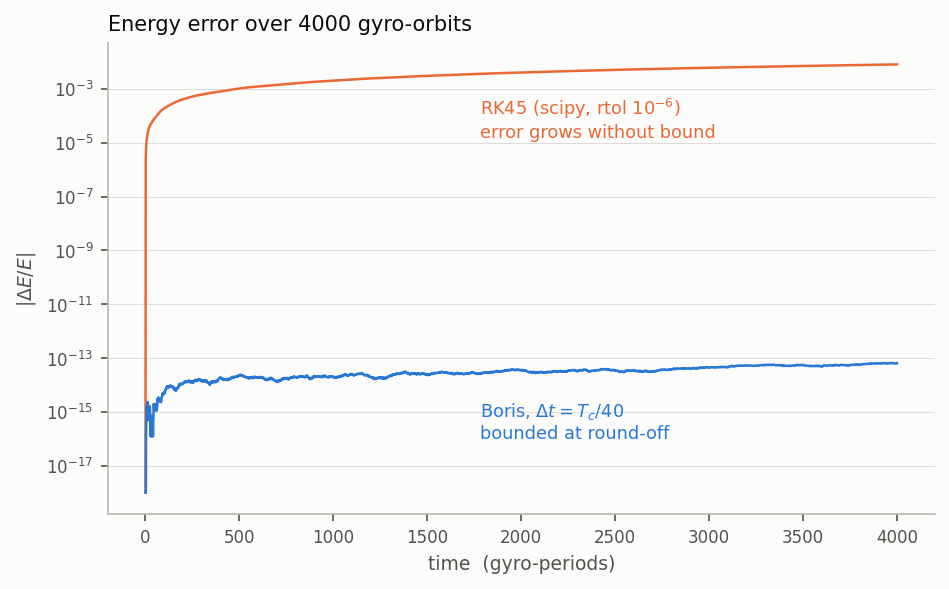

# Tokamak Orbit Confinement

Single-particle orbit integration in a simplified tokamak field, built to answer
one question: **when confinement fails as the poloidal field is weakened, does it
fail sharply or gradually?**

The answer is both, and the gap between them is the result. At a **fixed** pitch
angle the transition is a near-step: the loss fraction falls from 90% to 10%
across 2.7–10.5% of the midpoint current, and for co-going ions it is sharper
than the scan can resolve. An isotropic **ensemble** of the same ions has no
threshold at all — the same transition takes **157%** of the midpoint current,
some 27× broader.

The reason is that each pitch angle crosses its own sharp threshold at a
different plasma current, and those thresholds are spread over a factor of 8.3
(30.6 kA to 253.5 kA at the 50%-loss crossing). A population contains all of them at once, so its curve
is the smeared superposition of many step functions.



Full-orbit integration with a Boris pusher, no guiding-centre approximation in the
orbits themselves. Validated against analytic theory: grad-B and curvature drift
to 0.005–0.698%, second-order convergence measured at 2.000, and
$|\nabla\cdot\mathbf{B}| \sim 10^{-9}$.

---

## The result



Each fixed-pitch scan places 22 extra currents across its own transition, located
by a coarse bracketing pass first, so the widths below are resolved rather than
read off a grid.

| launch pitch | threshold $I_p$ | 90%→10% width | as % of midpoint | points inside |
|---|---|---|---|---|
| $\xi = +0.80$ (co-passing) | 30.6 kA | ≤ 1.09 kA | **≤ 3.5%** | 0 — unresolved |
| $\xi = +0.45$ (co-going) | 37.0 kA | ≤ 1.02 kA | **≤ 2.7%** | 0 — unresolved |
| $\xi = 0.00$ (deeply trapped) | 90.2 kA | 5.3 kA | **5.8%** | 4 |
| $\xi = -0.45$ (counter-going) | 253.5 kA | 26.6 kA | **10.5%** | 4 |
| isotropic ensemble, 300 ions | 124 kA | 195 kA | **157%** | 5 |

At the two co-going pitches every one of the 48 particles flips from lost to
confined between adjacent grid points — those two rows are **upper bounds**, not
measurements: the transition is narrower than 1.1 kA and we do not know by how
much. The deeply-trapped and counter-going rows are genuinely resolved.

Three things have to be said in the same breath as that table.

"Confinement time" here means the time for a collisionless test particle to reach
$r = a$. It is an orbit loss time, not an energy confinement time in the
experimental sense, and above ~320 kA it is **censored** — nothing is lost within
the 150 µs integration window, so those points are lower bounds.

The thresholds sit where they do because orbits are displaced radially by an
amount set by the sign of $v_\parallel$: co-going inboard, away from the wall;
counter-going outboard, into it. Measured at $|\xi| = 0.45$, identical energy:
the co-going orbit spans $r \in [0.071, 0.160]$, the counter-going one
$[0.160, 0.234]$. That is why a counter-going ion needs seven times more plasma
current to stay confined than a co-going one, and why loss in this machine is
overwhelmingly a counter-going phenomenon.

Finally, the "27× broader" comparison is conservative in one direction and
generous in another: it divides the ensemble width by the *sharpest resolved*
single-pitch width (5.8%). Against the unresolved co-going rows the true ratio is
larger and unknown. Against the counter-going row it is 15×.

---

## Why a poloidal field is needed



In the toroidal field alone, $\nabla B$ and the field-line curvature both point
inboard, and both drive a vertical drift in the same direction:

$$ v_D = \frac{m}{qBR}\left(v_\parallel^2 + \tfrac{1}{2}v_\perp^2\right) $$

Nothing returns the particle, so the drift does not average away and every ion
marches out of the machine at a few km/s no matter how strong the field is. This
is measured against the formula above to **0.005–0.698%** across a 20× range of
energy — an absolute prediction, prefactor and all, with nothing fitted.

Adding a poloidal component twists the field lines into helices, so a particle
spends half its time above the midplane and half below and the drift largely
cancels. Confinement is a property of field-line **topology**, not field strength.

---

## Validation

| what | result |
|---|---|
| $\nabla\cdot\mathbf{B}$ | $10^{-9}$ relative, over 300 interior points, all currents and profiles |
| Order of accuracy | 1.974, 1.993, 1.998, 2.000, 2.000 → second order; matches the exact discrete form to 5 s.f. |
| Energy conservation (Boris) | $\lvert\Delta E/E\rvert < 10^{-13}$ across every production scan, bounded |
| Grad-B + curvature drift | 0.005 – 0.698% |
| $E\times B$ drift | 0.026 – 0.045%, species-independent to $8\times10^{-5}$ |
| Trapped fraction vs $\sqrt{2\epsilon/(1+\epsilon)}$ | 3.7% at $r=0.15$; up to 38% off elsewhere — see below |
| Banana width scaling | $w_b \propto B_\theta^{-0.950}$ (ideal $-1$), $\propto E^{0.464}$ (ideal $+1/2$) |
| Collision operator, Legendre eigenmodes | $l=1,2,3$ rates within 0.2% of the exact $l(l+1)\nu_d/2$ |
| Collisional detrapping | $\tau \propto \nu_d^{-0.962}$ (ideal $-1$) over 333x in collision frequency |
| Energy-operator drag vs NRL speed drag | identical to $2.6\times10^{-13}$, all mass ratios H/D/T/He4 |
| Thermalisation | cold and hot starts reach the same Maxwellian; KS below the 95% critical value at $\nu\Delta t \leq 0.005$ |
| $\nabla\cdot\mathbf{B}$ with field ripple | $10^{-9}$ relative — unchanged by breaking axisymmetry |
| Solov'ev force balance $\mathbf{J}\times\mathbf{B} = \nabla p$ | $2.7\times10^{-10}$, from a numerically differenced `b_field` |
| Test suite | 234 tests, run on push |



**The trapped-fraction row is the weakest one here and is presented as such.** It
matches theory to 3.7% at $r = 0.15$ m and deviates by up to 38% at other radii —
7.3σ, so not statistics. At small $r$ the banana orbit is 1.85× *wider than the
flux-surface radius it supposedly sits on*, so the thin-orbit assumption behind
the formula is meaningless there; at large $r$ the widest orbits hit the wall and
are removed from the sample, biasing what remains. It agrees precisely where its
assumptions hold, which is a narrower window than the headline number suggests.

Worse, in this field model $|B|$ is *exactly* proportional to $1/R$ on a flux
surface (verified at $2\times10^{-16}$), which makes $\sqrt{2\epsilon/(1+\epsilon)}$
exact by construction rather than approximate. So that comparison validates the
integrator, classifier and sampling — **not** the field model. Detail in
[`docs/DOC_SELF_REVIEW.md`](docs/DOC_SELF_REVIEW.md) findings 4 and 12.

---

## Collisions



The collisionless result above says a *population* has no sharp loss threshold
because it contains many pitch angles at once, each with its own. Collisions let
a **single** ion wander across pitch angles within its own lifetime — so it
should sample many thresholds too.

It does, and the threshold does not merely broaden. It stops existing.

| $\nu_d$ (s$^{-1}$) | highest $I_p$ at which one $\xi=-0.45$ ion is still lost |
|---|---|
| collisionless | 266 kA |
| $10^4$ | 600 kA (2.3×) |
| $10^5$ | 1029 kA (3.9×) |
| $10^6$ | $\geq$1600 kA (≥6×) — still lost at the top of the scan |

Collisionlessly that ion is perfectly confined above 266 kA. At
$\nu_d = 10^5$ s$^{-1}$ it is still being lost at four times that current, and at
$10^6$ I never found a current high enough — the scan ran out first, so that row
is a lower bound. Loss is overwhelmingly a counter-going phenomenon (those orbits
sit outboard, into the wall); a collisionless ion keeps the pitch it was born
with, while a collisional one is eventually walked into the counter-going region
whatever the plasma current. **The sharp threshold is an artefact of forbidding
the particle to change pitch.**



The operator is Monte Carlo pitch-angle scattering (Lorentz). Its validation is
the sharpest in the project: Legendre polynomials are *exact* eigenfunctions with
decay rate $l(l+1)\nu_d/2$, so the test has no free parameters at all, and
$l=1,2,3$ come out within 0.2% at $\nu_d\Delta t = 0.01$. The update also
provably cannot leave $[-1,1]$ — Cauchy-Schwarz bounds it by
$\sqrt{1-a+a^2}$ — and the measured maximum matches that bound to five decimals.

**Detrapping** reproduces the standard $\tau = \epsilon/\nu_d$ estimate to
within 4% in exponent ($-0.962$ against $-1$) and 12% in magnitude, across 333×
in collision frequency and spanning the banana-plateau boundary.

That is the second answer. The first was $-0.779$, a 22% discrepancy that
survived checks on censoring, on trajectory sampling, and on wall loss as a
competing risk, and which I published as an unexplained failure. It was none of
those: it was the **collision** timestep. The operator is validated against the
Legendre decay rates, which are a *bulk* property and converge quickly; a
detrapping time is a **first-passage** quantity, and at $\nu_d\Delta t = 0.02$
the pitch moves 0.135 per step against a 0.211 distance to the boundary — so the
particle arrived in two discrete jumps rather than diffusing. Validating a scheme
on a bulk statistic does not validate it for a first-passage one. See
[`docs/DOC_SELF_REVIEW.md`](docs/DOC_SELF_REVIEW.md) findings 22 and 23.

That operator is pitch-angle only. What follows replaces it with one that has a
temperature.

---

## Three things the toy model could not do

The result above rests on a field that is divergence-free and topologically a
tokamak but is **not** an equilibrium, a collision operator with no temperature,
and exact axisymmetry. Each of those is a specific limitation with a specific
consequence, and each now has a module that removes it.

**A real equilibrium** (`equilibrium.py`). The Solov'ev solution of
Grad–Shafranov — the analytic case where $p'$ and $FF'$ are constant. Verified
by force balance, $\|\mathbf{J}\times\mathbf{B} - \nabla p\|/(\|J\|\|B\|) =
2.7\times10^{-10}$, with $\mathbf{J}$ differenced from `b_field` itself. That
check exists because the obvious one — a finite-differenced Grad–Shafranov
residual — turned out to be floating-point roundoff that never evaluates the
field at all: an $F^2(\psi)$ mutation that breaks the equilibrium left all 28
tests passing. Force balance moves nine orders of magnitude on the same
mutation, and both facts are now asserted by tests (finding 26). Its Shafranov shift displaces
the magnetic axis outboard of the boundary centre by $0.24a$, which breaks the
$|B|R = \text{const}$ identity that made the circular model's trapped fraction
partly true by construction, and moves the trapping boundary outward by 2.3% at
$r = 0.10$ m growing to 5.7% at $r = 0.25$ m. The test suite asserts the
converse too: the circular field does *not* solve Grad–Shafranov, and by how
much.



**Energy scattering and drag** (`collisions_full.py`). A background Maxwellian
at a real density and temperature, with velocity-dependent frequencies and a
speed operator. The drag is **derived**, not quoted: requiring a Maxwellian to
carry zero probability flux fixes it uniquely. It then turns out to equal the
NRL speed drag $-(\nu_s - \tfrac12\nu_\perp)v$ *identically* — to
$2.6\times10^{-13}$ over three decades of speed, through the sign change, for
every mass ratio in H/D/T/He⁴. Note the $-\tfrac12\nu_\perp$: $\nu_s$ alone is the *momentum* drag, and a pure
deflection carries momentum away without slowing the particle — the two differ
by a factor approaching two at equal masses in the high-energy limit, and below
$0.80\,v_{\rm th}$ the speed drag changes sign while the momentum drag does not.
That trap is now a named regression test.



**Field ripple** (`ripple.py`). Finite coil number, which destroys the exact
conservation of canonical toroidal momentum that protects every axisymmetric
orbit here from radial wandering. The obvious implementation —
$B_\phi \to B_\phi(1 + \delta\cos N\phi)$ — is *not* divergence-free, which is
the very first bug this project found, in a new dimension. Deriving it instead
from a harmonic scalar potential (ripple is a vacuum field) keeps
$\nabla\cdot\mathbf{B}$ at $10^{-9}$ while the naive version sits at
$2.7\times10^{-2}$, and the test suite identifies the naive leftover *exactly*
as the missing term rather than merely calling it large.

---

## Why the Boris pusher, not `scipy`



RK45 is not symplectic and its energy error accumulates without bound. A
production run is $1.3\times10^5$ timesteps — $3.3\times10^3$ gyro-orbits — over
which an RK45 ion silently gains or loses energy. Since confinement is measured
by watching that ion drift to the wall, an integrator that changes its energy
manufactures the answer.

Boris applies the magnetic rotation exactly, so $|v|$ is preserved to round-off at
any step size.

**Energy conservation is not evidence of convergence, though.** A rotation by the
wrong angle is still a rotation: at $\Delta t = T_c/2$ the orbit is completely
wrong and the energy error is still $10^{-14}$. The resolution claim rests on the
convergence study, not on the flat energy trace.

---

## Install and run

```bash
git clone https://github.com/loghas31/tokamak-orbits
cd tokamak-orbits
pip install -e ".[dev]"

pytest -q                                    # 148 tests, ~4 min
python scripts/run_experiments.py --quick    # coarse reproduction, ~4 min
python scripts/make_figures.py               # regenerate every figure
```

Full reproduction of every number in [`RESULTS.md`](RESULTS.md):

```bash
python scripts/run_experiments.py            # ~75 min
```

Fixed seeds and a fixed timestep policy throughout; the same random sample is used
at every point of a scan, so a scan measures the response to the field rather than
sampling noise.

### Minimal example

```python
from tokamak_orbits import TokamakField
from tokamak_orbits.particles import initialise
from tokamak_orbits.pusher import integrate, gyroperiod
from tokamak_orbits.diagnostics import classify, make_loss_func

field = TokamakField()                       # R0=1m, a=0.3m, B0=2T, Ip=450kA
x0, v0, m, q = initialise(field, energy_ev=10e3, r_start=0.15,
                          pitch=[0.9, 0.45, -0.45, 0.0])

dt = gyroperiod(m, q, 2.9) / 40
traj = integrate(x0, v0, dt, int(6e-5 / dt), m, q, field.b_field,
                 sample_every=10, loss_func=make_loss_func(field))

s = classify(field, traj, m, q)
print(s.kind)           # ['passing' 'trapped' 'trapped' 'trapped']
print(s.radial_width)   # banana widths, metres
```

---

## The model

- **Toroidal field** $B_\phi = B_0R_0/R$, from external coils.
- **Poloidal field** from a toy current profile $j_\phi \propto (1-(r/a)^2)^\nu$,
  giving $B_\theta = \frac{R_0}{R}\frac{\mu_0 I(r)}{2\pi r}$.
- **Default machine** $R_0 = 1$ m, $a = 0.3$ m, $B_0 = 2$ T, $\epsilon = 0.3$,
  deuterium at 10 keV.

`plasma_current = 450` kA is a **profile parameter**, not the current the field
encloses: Ampère loops give 471.7 kA at $r = a$. Likewise the conventional labels
$q_0 = 1.0$, $q(a) = 2.0$ are the cylindrical approximation — the true field-line
values are 1.000 and **2.097**. Both gaps are the same factor
$R_0/\sqrt{R_0^2-r^2}$ introduced by the $R_0/R$ term below. Scan axes keep the
nominal labels for continuity; `safety_factor_exact` and
`enclosed_current_actual` give the real ones.

That $R_0/R$ factor on the poloidal field is the single most important line in the
repository. Without it the field is **not divergence-free** on a torus —
$\nabla\cdot\mathbf{B} = B_R/R$, measured at 4.8% max and 2.8% median of
$|B|/a$ — which is not a magnetic field at all and corrupts every orbit at
$O(\epsilon)$. With it, the
field is exactly $\nabla\psi\times\nabla\phi + F\nabla\phi$ and solenoidal by
construction. A test rebuilds the buggy version and asserts its divergence is
large, so the correction cannot be quietly removed.

**What this is not:** circular concentric flux surfaces with no Shafranov shift do
not solve the Grad-Shafranov equation. This field is a divergence-free toy with
tokamak-like topology, and it is the field carrying every result in the sections
above. A real Grad-Shafranov equilibrium, a collision operator with a
temperature, and a non-axisymmetric ripple field all exist in this package
(`equilibrium.py`, `collisions_full.py`, `ripple.py`) — but the headline scans
were not re-run on any of them, and none of the three adds electric fields or
self-consistency. Nothing here is a prediction about a real machine. The full
boundary between what is proven and what is assumed is in
[`docs/DOC_STATUS.md`](docs/DOC_STATUS.md).

---

## Repository

```
tokamak_orbits/     field model, Boris pusher, diagnostics, scans
tests/              234 tests (run on push)
scripts/            run_experiments.py, make_figures.py
docs/               physics, numerics, self-review, status
results/            raw JSON from every experiment
figures/            every figure, regenerated from results/
```

| document | what it is |
|---|---|
| [`RESULTS.md`](RESULTS.md) | every measurement, including the ones that did not work |
| [`docs/DOC_SELF_REVIEW.md`](docs/DOC_SELF_REVIEW.md) | **26 findings against my own work** — bugs found, claims retracted, results downgraded |
| [`docs/DOC_STATUS.md`](docs/DOC_STATUS.md) | the boundary between proven and assumed |
| [`docs/PHYSICS.md`](docs/PHYSICS.md) | the model and the analytic references |
| [`docs/NUMERICS.md`](docs/NUMERICS.md) | integrator, convergence, error budget |

The self-review is the document worth reading. Thirteen of its twenty-six entries
changed a headline number: a field that was not divergence-free, a banana-width
scan measuring orbits that were not bananas, a 1.5% systematic from combining
position and velocity that a leapfrog stores half a step apart, a drift
validation contaminated by that same bug through a duplicated formula, four
results tables the shipped code could not regenerate, and a "sharp threshold"
whose width was set by the scan grid rather than measured; a detrapping test that
applied a midplane formula at every poloidal angle; a collision-operator artefact
I documented in a docstring that provably cannot occur; and a collision timestep
that was small at the start of a slowing-down run and, by the end of it, wrong by
six orders of magnitude while every other diagnostic stayed clean.

Fifteen of them were found by adversarial review passes run against the
repository *after* everything already passed. The last such pass, against three
newly finished modules with 77 green tests, returned thirty issues and killed
nine published claims — including a "validation" that was floating-point
roundoff and never touched the field it validated, and two statistics that were
zero and one **by construction**. Finding 26 records the pattern: the sentences
that turned out to be wrong were the ones written to sound rigorous. Finding 22 is a retraction of a retraction:
a result published as an unexplained failure, which turned out to be my own
under-resolved timestep and not a failure of the theory at all.

---

## Limitations

**The field carrying the headline result is a toy.** Circular concentric flux
surfaces with no Shafranov shift do not solve Grad–Shafranov, and the implied
current density is not a flux function. A real analytic equilibrium (Solov'ev)
is implemented and validated to a Grad–Shafranov residual of $10^{-7}$, and it
moves the trapping boundary outward by 2.3–5.7% — but the main current scan was
**not** re-run on it, so the §4 thresholds carry an unquantified geometry error.

**Two collision operators, and only one has a temperature.** §7's Lorentz
operator scatters pitch at fixed speed and a dialled frequency; §9's full
operator has a background density and temperature, energy scattering, and a drag
derived from detailed balance. The §7 scans were not repeated with the full
operator. Neither conserves momentum between species — the background is a fixed
Maxwellian at rest with no back-reaction — so there is **no bootstrap current**
and no complete neoclassical calculation. No neoclassical diffusion coefficient
was measured.

**Ripple is present but only as a loss mechanism.** The ripple field is
divergence-free by construction (derived from a harmonic potential, not written
down component-wise), and it does lose particles the axisymmetric field
confines. It does not measure a ripple transport coefficient, and the amplitudes
used are at or above the high end for a real machine, chosen so the effect is
visible in a short run.

Still absent: electric fields beyond a static $E\times B$ validation, time
dependence, wall interaction, and any self-consistency between the particles and
the current that produces the field they move in.

Known weaknesses in what *is* measured: the confinement-time curve is censored
above ~320 kA. Bounce *counts* are unreliable for deeply trapped particles,
though their classification is not. The magnetic moment, quoted at 14% error for
$\xi = 0.95$, reaches **123%** in the widest-orbit production runs — the orbits
are unaffected, being full-orbit, but no guiding-centre reading of those runs is
valid. The Solov'ev trapped-fraction *measurements* are sampling-limited at
$\pm 0.05$ and do not by themselves separate the two field models.

MIT licensed.
